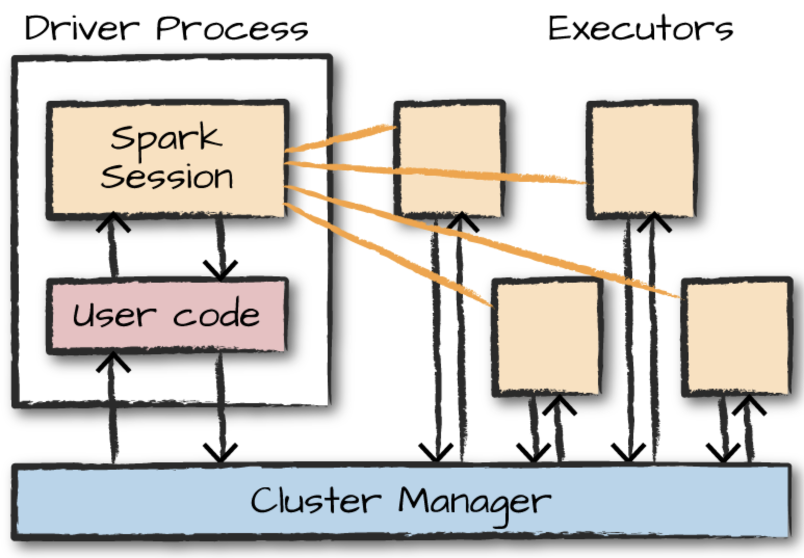
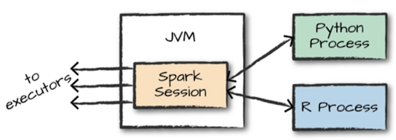
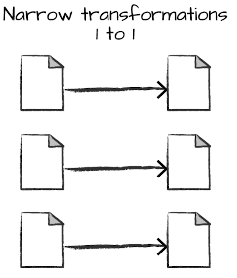
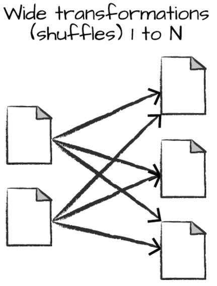

# 스파크 살펴보기

## 1. 스파크 기본 아키텍쳐

'컴퓨터' 하나(가정용)로 수행하기 힘든 작업 -> 대규모 데이터 처리

데이터 연산이 가능하다 해도 오랜 수행시간이 걸린다. 따라서 '클러스터'를 만듦

- 클러스터
    - 클러스터는 여러 컴퓨터의 자원을 모아 하나의 컴퓨터 처럼 사용 할 수 있게 만듦

하지만, 클러스터를 구성하는 것만으로는 부족하며, 클러스터에서 [작업]을 조율할 수 있는 프레임 워크가 필요
-> 스파크

- 스파크
    클러스터의 데이터 처리 작업을 관리하고 조율하는 역할을 한다.

    1) 사용자는 클러스터 매니저에 스파크 애플리케이션을 제출하고
    2) 제출받은 클러스터 매니저는 애플리케이션 실행에 필요한 자원을 할당
    3) 우리는 할당받은 자원으로 작업을 처리

    - 스파크 연산에 이용되는 클러스터
        - 스파크 스탠드얼론(standalone) 클러스터 매니저
        - 하둡 Yarn
        - 메소스 Mesos
    
- 스파크 애플리케이션

    스파크 애플리케이션은 [드라이버 프로세스와 다수의 익스큐터 프로세스] 로 구성됨.

    - 드라이버 프로세스

    클러스터 노드 중 하나에서 실행되며 main()함수를 실행

    1) 스파크 애플리케이션 정보의 유지관리
    2) 사용자 프로그램이나 입력에 대한 응답
    3) 전반적인 익스큐터 프로세스의 작업과 관련된 분석, 배포 스케쥴링 역할을 하기에 필수적임

    스파크 애플리케이션의 심장과 같은 존재로 애플리케이션의 수명주기동안 관련정보를 모두 유지한다.

    - 익스큐터

    드라이버 프로세스가 할당한 작업을 수행 다음 두가지역할을 한다.
    1) 드라이버가 할당한 코드를 실행
    2) 진행상황을 드라이버 노드에 보고

    

    위 그림에서 클러스터 매니저는 다음과 같은 매니저를 쓴다.
    - Spark standalone cluster manger
    - yarn
    - mesos 

    그림 왼쪽에 드라이버 프로세스가 있고 4개의 익스큐터가 있는데, 사용자는 각 [노드에 할당할 익스큐터 수]를 지정할 수 있다.

    > note
    > 스파크는 클러스터 모드 뿐 아니라 로컬모드도 지원한다.
    > 드라이버와 익스큐터는 단순한 프로세스이므로 같은 머신이나 서로 다른 머신에서 실행가능
    > 로컬로 실행한다면 드라이버와 익스큐터를 단일머신에서 스레드형태로 실행한다.

## 2. 스파크의 다양한 언어 API

스파크의 언어 API를 이용하면 다양한 프로그래밍 언어로 스파크 코드를 실행할 수 있다. 스파크는 모든 언어에 맞는 몇몇 '핵심 개념'을 제공하는데, 이러한 핵심 개념은 클러스터 머신에서 실행되는 스파크 코드로 변환된다.

구조적 API만으로 작성된 코드는 언어에 상관없이 유사한 성능을 발휘하게 된다.

- 스파크 지원 언어
    - 스칼라
        스파크는 스칼라로 개발되어 있으므로 스칼라가 '기본'언어

    - 자바
        스파크가 스칼라로 개발되어 있지만, 스파크 창시자들은 자바를 이용해 스파크 코드를 작성할 수 있도록 만듦

    - 파이썬
        파이썬은 스칼라가 지원하는 거의 모든 구조를 지원

    - SQL

    - R

- SparkSession과 스파크의 언어 API간의 관계

각 언어 API는 스파크 코드를 실행하기 위해 SparkSession 객체를 진입점으로 사용할 수 있다.
파이썬이나 R로 스파크를 사용할 때는 JVM 코드를 명시적으로 작성하지 않고, 스파크는 사용자를 대신해 파이썬이나 R로 작성한 코드를 익스큐터의 [JVM에서 실행할 수 있는 코드로 변환]함

즉, 여러 언어를 지원할 수 있도록 JVM이 변환하는 역할을 해줌

다양한 언어로 스파크를 사용할 수 있는 이유는 스파크가 기본적으로 두가지 API를 제공하기 때문

1) 저수준의 비구조적 API
2) 고수준의 구조적 API

## 3. 스파크 실행

01에서 환경설정을 잘 따라왔다면, 다음 코드로 spark실행이 가능하다.

'''zsh
$ pyspark
'''

> Note
> 대화형 모드로 스파크를 시작하면 스파크 애플리케이션을 관리하는 SparkSession이 자동으로 생성
> 하지만, standalone 애플리케이션으로 스파크를 시작하면 사용자 애플리케이션 코드에서 SparkSession객체를 직접 생성해야한다.

## 4. 트랜스 포메이션
스파크의 핵심 데이터 구조는 불변성을 가짐. 즉 한번 생성하면 변경할 수 없다.

따라서, 데이터 구조를 변경 하려면 변경 방법을 스파크에 알려줘야 함. 이를 트랜스포메이션이라고 부름

트랜스포메이션은 스파크에서 비지니스 로직을 표현하는 핵심개념이며 두가지 유형이 있다.

1) 좁은 의존성(narrow dependency)
    
    - 각 입력 파티션이 하나의 출력 파티션에만 영향을 미침
    - 위의 where 구문은 좁은 의존성

    
2) 넓은 의존성(wide dependency)
    
    - 하나의 입력 파티션이 여러 출력 파티션에 영향을 미침

    
    - 셔플은 다른 방식으로 동작하는데, 스파크는 셔플의 결과를 디스크에 저장하게 됨
    
> __[Note]__  
> 스파크가 클러스터에서 파티션을 교환  
> 좁은 트랜스포메이션을 사용하면 스파크에서 파이프라이닝을 자동수행  
> DataFrame에 여러 필터를 지정하는 경우 모든 작업이 메모리에서 일어난다.  

## 5. 지연 연산 (lazy evaluation)

지연 연산은 스파크가 연산 그래프를 처리하기 직전까지 기다리는 동작 방식을 의미.

1. `실행계획 생성`
    
    특정 연산 명령이 내려진 즉시 데이터를 수정하지 않고 원시 데이터에 적용할 트랜스포메이션의 [실행계획을 생성]
    
    
2. `간결한 물리적 실행계획 컴파일`

    스파크는 코드를 실행하는 마지막 순간까지 대기하다가 원형 DataFrame 트랜스포메이션을 [간결한 물리적 실행 계획으로 컴파일함]
   
스파크는 이 과정을 거치면서 전체 데이터 흐름을 [최적화] 하는 엄청난 강점을 가지고 있음

ex) DataFrame의 조건절 푸시다운(predicate pushdown)

    아주 복잡한 스파크 잡이 원시데이터에서 하나의 로우만 가져오는 필터를 가지고 있다면, 필요한 레코드 하나만 읽는 것이 가장 효율적임.
    
    스파크는 이 필터를 데이터 소스로 위임하는 최적화 작업을 자동으로 수행한다. (어떻게..?)

## 6. 액션

사용자는 트랜스 포메이션을 사용해 논리적 실행 계획을 세울 수 있음

하지만, 실제연산을 수행하려면 액션 명령을 내려야 한다. 액션은 일련의 트랜스포메이션으로부터 결과를 계산하도록 지시하는 명령임.

가장 단순한 액션인 count 메서드는 DataFrame의 전체 레코드 수를 반환한다.

## 실습

깃허브에서

Spark-Study/code/02.ipynb 파일을 참조한다.
