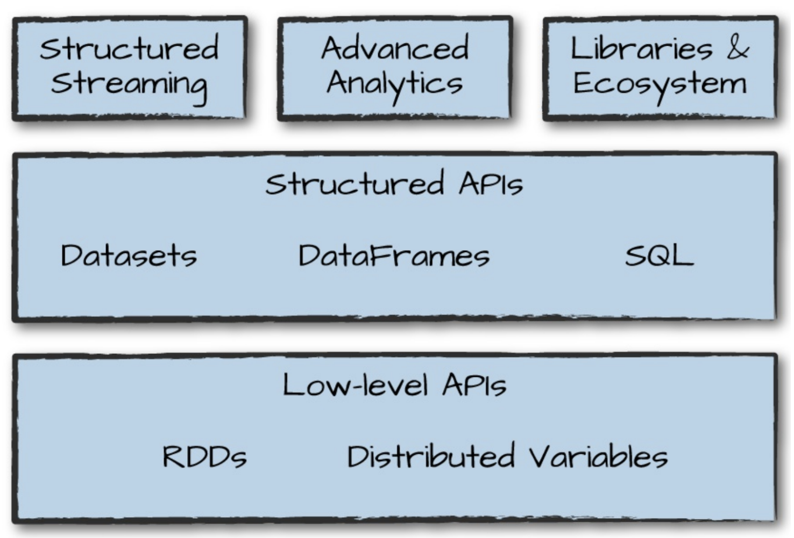

# 스파크 기능 둘러보기
스파크는 기본 요소인 저수준 API와 구조적 API 그리고 추가 기능을 제공하는 표준 라이브러리로 구성 되어 있다.


스파크의 라이브러리는 그래프 분석 / 머신러닝 / 스트리밍 등 다양한 작업을 지원

컴퓨팅 및 스토리지 시스템과 통합을 돕는 역할

## 1. 운영용 애플리케이션

스파크를 사용하면 빅데이터 프로그램을 쉽게 개발 가능
spark-submit 명령을 사용해 대화형 shell에서 개발한 프로그램을 `운영용 애플리케이션`으로 쉽게 전환할 수 있다. 

spark-submit 명령은 애플리케이션 코드를 클러스터에 전송해 실행시키는 역할

클러스터에 제출된 애플리케이션은 작업이 종료되거나 에러가 발생할 때 까지 실행되며, 클러스터 매니저(Standalone / mesos/ yarn)을 이용해 실행 된다.

```zsh
# spark를 설치한 경로에서 수행해야함. 또는 환경변수 설정 (spark-submit이 있는경로)
# pi값을 특정 자리수 까지 계산한다.
# shell 명령어
./bin/spark-submit \
--master local \
./examples/src/main/python/pi.py 10

```

master 옵션의 인숫값을 변경하면 스파크가 지원하는 클러스터 매니저에서 동일한 애플리케이션 실행가능

## 2. Dataset

타입 안정성을 제공하는 구조적 API

Dataset은 자바와 스칼라의 정적 타입 코드를 지원하기 위해 고안된 스파크의 구조적 API, 따라서 동적 타입 언어인 `파이썬과 R에서는 사용할 수 없다`.

> __동적 타입이란__
> int, char 같이 데이터 형을 명시해주는 것
> 파이썬은 명시하지 않아도 자동으로 변수타입을 지정해줌.

## 3. 구조적 스트리밍

스트림 처리용 고수준 API, 구조적 API로 개발된 배치 모드의 연산을 스트리밍 방식으로 실행할 수 있으며, 지연 시간을 줄이고 증분처리 할 수있음.

- [장점]
    - 배치 처리용 코드를 일부 수정하여 스트리밍 처리를 수행하고 값을 빠르게 얻을 수 있음  
    - 프로토 타입을 배치 잡으로 개발한 다음 스트리밍 잡으로 변환가능 -> 개념잡기 수월

예제 - 실습코드 참고


## 4. 머신러닝과 고급분석

MLlib을 사용해 대규모 머신러닝을 수행할 수 있다. 대용량 데이터를 대상으로 전처리/ 멍잉 / 모델학습 및 예측이 가능하며 구조적 스트리밍에서 예측하고자 할 때, MLlib에서 학습시킨 다양한 예측 모델을 사용할 수 있다.

스파크는 분류 / 회귀 / 군집화 / 딥러닝 등 머신러닝과 관련된 정교한 API를 제공함.

예제 - k-means 알고리즘 (실습코드 참고)

## 5. RDD: 스파크의 저수준 API

자바와 파이썬 객체를 다루는 데 필요한 다양한 기본 기능(저수준 API)을 제공하며, 스파크의 거의 모든 기능은 RDD기반으로 만들어짐. Dataframe 연산도 RDD 기반이며 편리하고 효율적인 분산처리를 위해 저수준 명령으로 컴파일됨.

원시 데이터를 읽거나 다루는 용도로 RDD를 사용할 수 있지만, 대부분은 구조적 API를 사용하는 것이 좋다. 하지만 RDD를 이용해 파티션과 같은 물리적 실행 특성을 결정할 수 있으므로 DataFrame보다 더 세밀한 제어가 가능함.

드라이버 시스템의 메모리에 저장된 원시 데이터를 병렬처리 하는 데 RDD 사용가능

보통, 비정형 데이터나 정제되지 않은 원시 데이터를 처리해야 할 때, RDD를 사용한다.

`스파크를 사용할 떄는, 정제된 데이터를 만들어놓고 구조화시켜 사용하는게 좋을 듯하다.`

## 6. 서드파티 패키지 에코시스템

커뮤니티가 패키지 에코시스템과 다양한 기능을 만들어 낸다.

일부는 스파크 코어 프로젝트에 포함되어 널리 사용되고 있고, 자신이 개발한 패키지를 공개할 수 있다.

> 오픈소스 프로젝트

스파크는 비지니스와 기술적 문제해결에 적용할 수 있고, 계속해서 에코시스템과 커뮤니티가 성장하여 패키지가 개발될 수록 여러 비지니스 문제를 성공적으로 해결할 수 있을 것. 
