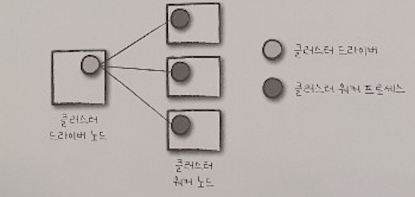
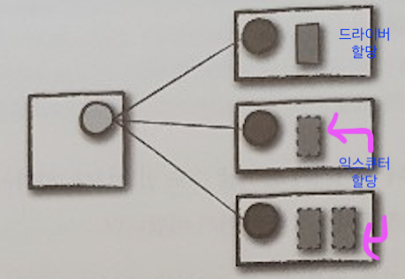
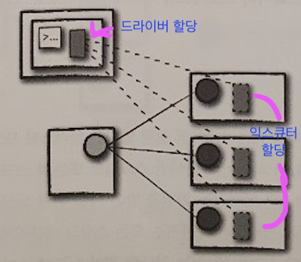
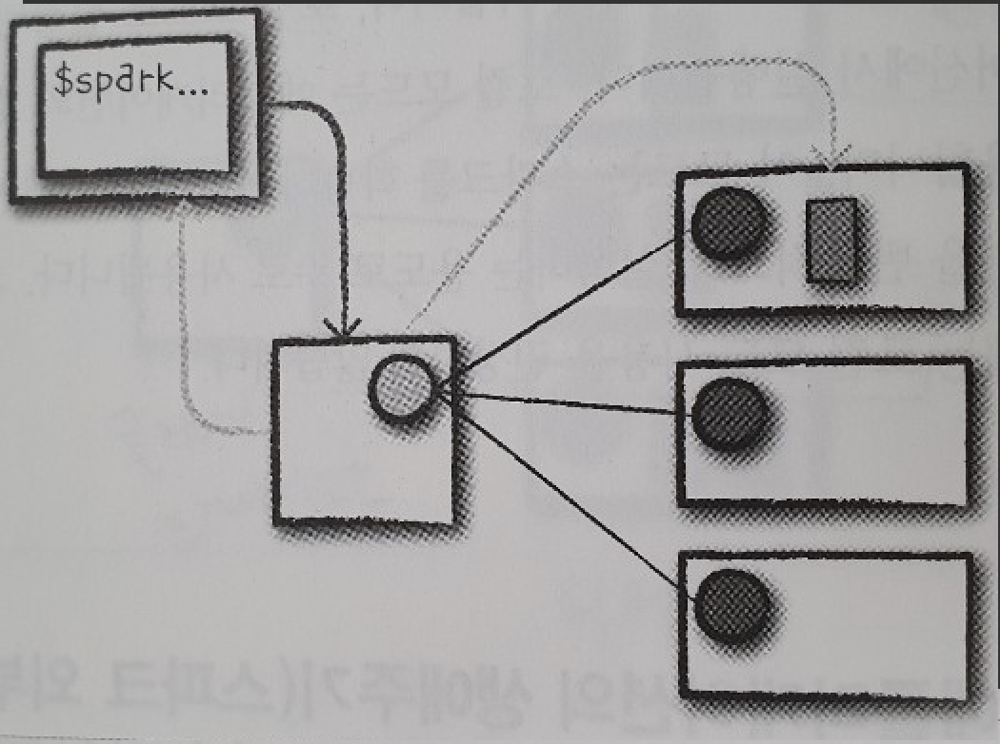

# 운영용 애플리케이션

# 클러스터에서 스파크 실행하기

스파크에서 코드를 실행할 때 어떤 일이 발생하는지?

결국 모든 스파크 코드는 동일한 방식으로 실행된다.

## 1. 스파크 애플리케이션의 아키텍쳐

  

- 스파크 드라이버
    스파크 애플리케이션의 `운전자 역할` 을 하는 프로세스.  
    드라이버는 스파크 애플리케이션의 실행을 제어하고 스파크 클러스터(익스큐터의 상태와 태스크)의 모든 상태 정보를 유지한다.  
    물리적 컴퓨팅 자원 확보와 익스큐터 실행을 위해 클러스터 매니저와 통신할 수 있어야 한다.  
    물리적 머신의 프로세스이며, 클러스터에서 실행 중인 애플리케이션의 상태를 유지함  

- 스파크 익스큐터
    스파크 드라이버가 할당한 태스크를 수행하는 프로세스  
    익스큐터는 드라이버가 할당한 태스크를 받아 실행하고 태스크의 상태와 결과(성공 or 실패)를 드라이버에 보고한다.  
    모든 스파크 애플리케이션은 개별 익스큐터 프로세스를 사용함  

- 클러스터 매니저
    스파크 드라이버와 익스큐터를 허공에 띄울 수는 없으므로, 클러스터 매니저가 필요하다.  
    클러스터 매니저는 스파크 애플리케이션을 실행할 클러스터 머신을 유지  
    ` 클러스터매니저 == 마스터 ` 라고 부르기도 함  

    이는 `드라이버` 와 `워커` 라는 개념을 가지고 있으며 이 때문에 혼란스러울 수도 있음  
    
    >__Note__
    > 이 개념 때문에 글쓴이는 현업에서 뭔소린지 잘 이해못한 경우가 많음

    프로세스가 아닌 물리적인 머신에 연결되는 개념이다.

      

    그림 왼쪽에 있는 머신은 클러스터 매니저의 드라이버 노드이며 원은 개별 워커노드를 실행하고 관리하는 데몬 프로세스.

    그림에서 스파크 애플리케이션은 아직 실행되지 않음. 표시된 원들은 클러스터 매니저의 프로세스일 뿐이다.

스파크 애플리케이션을 실제로 실행할 때가 되면 클러스터 매니저에 자원 할당을 요청  
스파크 애플리케이션의 실행 과정에서 클러스터 매니저는 애플리케이션이 실행되는 머신을 관리함.  
`사용자 애플리케이션의 설정에 따라 스파크 드라이버를 실행할 자원을 포함해 요청하거나 스파크 애플리케이션 실행을 위한 익스큐터 자원을 요청할 수도 있다.`

### 1.1 실행 모드
실행 모드는 애플리케이션을 실행할 때 요청한 자원의 물리적인 위치를 결정한다.

- 클러스터 모드
- 클라이언트 모드
- 로컬 모드

#### 클러스터 모드
가장 흔하게 사용되는 스파크 애플리케이션 실행방식  
이를 사용하려면 컴파일된 JAR 파일이나 파이썬 스크립트 또는 R 스크립트를 클러스터 매니저에 전달해야 함.  

  

하나의 워커노드에 스파크 드라이버를 할당하고 다른 워커 노드에 익스큐터를 할당하는 모습을 나타낸다.  

> __Note__
> 그림을 보면 헷갈리는게 드라이버 노드 드라이버 할당 익스큐터 할당 같은 용어들이 섞여나오는데  
> 왼쪽의 사각형 1개는 `클러스터`의 드라이버노드 이고 오른쪽 사각형 3개는 `클러스터`의 워커 노드  
> 오른쪽 사각형(`클러스터`의 워커노드) 안에 들어있는 실선 사각형은 `스파크 드라이버`를 할당 받은 것이다. 이를 명확히 해놓을 필요가 있다.  
> 실선 직사각형 : 드라이버 프로세스  
> 점선 직사각형 : 익스큐터 프로세스  

클러스터 매니저는 파일을 받고 워커노드에 드라이버와 익스큐터 프로세스를 실행  

즉, 클러스터 매니저는 모든 스파크 애플리케이션과 관련된 프로세스를 유지하는 역할

#### 클라이언트 모드

  

애플리케이션을 제출한 클라이언트 머신(왼쪽 상단)에 스파크 드라이버가 위치한다.

- 클라이언트 머신 : 스파크 드라이버 프로세스를 유지  
- 클러스터 매니저 : 익스큐터 프로세스를 유지

스파크 애플리케이션이 클러스터와 무관하나 머신에서 동작하는 것을 알 수 있음. 보통 이런 머신을 `게이트웨이 머신` 또는 `에지 노드` 라고 부름

드라이버는 클러스터 외부의 머신에서 실행되며, 나머지 워커는 클러스터에 위치한다.

#### 로컬 모드
모든 스파크 애플리케이션은 단일 머신에서 실행된다. 로컬 모드는, 애플리케이션의 병렬 처리를 위해 단일 머신의 `스레드` 를 활용한다. 이 모드는 스파크를 학습하거나 애플리케이션 테스트 그리고 개발 중인 애플리케이션을 반복적으로 실험하는 용도로 주로 사용.

> __NOTE__  
> SK에서 서비스하는 대표적인 빅데이터 플랫폼인 Accuinsight를 사용하면 쉽게 운영용 애플리케이션을 실험하는 용도로 사용 가능하다.  
> MCM 에서 클러스터를 쉽게 구성가능하기 때문  

## 2. 스파크 애플리케이션의 생애주기(스파크 외부)

03에서 소개한 spark-submit 명령을 사용해 애플리케이션을 실행하는 예제

하나의 드라이버 노드와 세개의 워커노드로 구성된 총 네 대 규모의 클러스터가 실행되고 있다 가정.

>__NOTE__  
> 네트워크 통신에 관해  
> 두꺼운 화살표 선: 스파크나 스파크 관련 프로세스가 수행하는 통신  
> 점선은 클러스터 매니저와의 통신 같은 일반적인 통신

- 1. 클라이언트 요청

    # 15-4 그림 부터 넣어야함

      

    첫 단계는 스파크 애플리케이션 제출
    스파크 애플리케이션은 컴파일된 JAR나 라이브러리 파일을 의미한다.
    
    스파크 애플리케이션을 제출하는 시점에 로컬머신에서 코드가 실행되어 클러스터 드라이버 노드에 요청
    이 과정에서 `스파크 드라이버 프로세스`의 자원을 함께 요청

    클러스터 매니저는 이 요청을 받아 클러스터 노드 중 하나에 드라이버 프로세스를 실행한다.
    
    스파크 잡을 제출한 클라이언트 프로세스는 종료되고 애플리케이션은 클러스터에서 실행됨.

    위 과정을 위한 명령을 터미널에서 다음과 같이 실행한다.

    ~~~zsh
    ./bin/spark-submit \
    --class <main-class> \
    --master <master-url> \
    --deploy-mode cluster \
    --conf <key>=<value> \
    ... # 다른 옵션
    <application-jar> \
    [application-arguments]
    ~~~

- 2. 시작
    드라이버 프로세스가 클러스터에 배치되었으므로 사용자 코드를 실행

    사용자 코드에는 반드시 스파크 클러스터를 초기화하는 SparkSession이 포함 되어야 한다.

    Sparksession은 클러스터 매니저와 통신해 스파크 익스큐터 프로세스의 실행을 요청함.

    사용자는 spark-submit을 실행할 때 사용하는 명령행 인수로 익스큐터 수와 설정값을 지정가능.

    클러스터 매니저는 익스큐터 프로세스를 시작하고 결과를 응답받아 익스큐터의 위치와 관련정보를 드라이버 프로세스로 전송하고 모든 작업이 정상적으로 완료되면 '스파크 클러스터'가 완성됨

- 3. 실행
    '스파크 클러스터' 가 생성되었으므로 코드를 실행한다.

    드라이버와 워커는 코드를 실행하고 데이터를 이동하는 과정에서 서로 통신한다.
    
    드라이버는 각 워커에 태스크를 할당. 태스크를 할당받은 워커는 `태스크의 상태와 성공/실패 여부`를 드라이버에 전송

- 4. 완료
    스파크 애플리케이션의 실행이 완료되면 드라이버 프로세스가 성공이나 실패 중 하나의 상태로 종료.

    클러스터 매니저는 드라이버가 속한 스파크 클러스터의 모든 익스큐터를 종료시킴. 이 시점에 스파크 애플리케이션의 성공/실패 여부를 클러스터 매니저에 요청에 확인 가능

## 3. 스파크 애플리케이션의 생애주기(스파크 내부)
위에서는 클러스터 관점( 스파크를 지원하는 인프라 관점)에서 스파크 애플리케이션의 생애주기를 알아 보았음.

그러나, 애플리케이션을 실행하면 스파크 내부에서 어떤 일이 발생하는지 알아야 함.

스파크 애플리케이션을 정의하는 실제 '사용자 코드'와 관련된 얘기를 할 건데, 스파크 애플리케이션은 하나 이상의 `스파크 잡`으로 구성됨, 스레드를 사용해 여러 액션을 병렬로 수행하는 경우가 아니면, 애플리케이션의 스파크 잡은 차례대로 실행된다.

- 1. SparkSession
    모든 스파크 애플리케이션은 가장 먼저 SparkSession을 생성함. 여러 대화형 모드에서는 자동으로 생성되지만, 애플리케이션을 만드는 경우 직접생성 해야함.

    기존 코드에서 new SparkContext 패턴을 사용함, 그러나 SparkSession의 필터 메서드를 사용해 생성할 것을 추천.
    
    1) 스파크와 스파크 SQL 컨택스트를 new SparkContext 패턴을 사용해서 만드는 것보다 안전하게 생성 가능.

    2) 다수의 라이브러리가 세션을 생성하려는 상황에서 컨택스트 충돌을 방지하기 때문

    ~~~pyspark
    from pyspark.sql import SparkSession

    spark = SparkSession.builder.master("local").sppName("Word Count")\
    .config("spark.some.config.option", "some-value")\
    .getOrCreate()
    ~~~

    SparkSession을 생성하면 스파크 코드를 실행할 수 있다. SparkSession을 사용해 모든 저수준 API, 기존 컨텍스트 그리고 관련 설정 정보에 접근 가능.

    SparkSession 클래스는 스파크 2.x 버전에서만 사용 가능. 과거 버전의 코드에서는 구조적API를 사용하기 위해 `SparkSesison` 대신 `SparkContext와 SQLContext`를 직접 생성

    ### SparkContext
    SparkSession의 SparkContext는 스파크 클러스터에 대한 연결을 나타냄
    SparkContext를 이용해 RDD같은 스파크의 저수준 API를 사용할 수 있다.
    스파크 과거 버전의 예제나 문서를 보면 SparkContext는 일반적으로 `sc` 변수를 사용함.
    
    SparkContext로 RDD, 어큐뮬레이터 그리고 브로드캐스트 변수를 생성하고 코드를 실행 할 수있음.
    
    >__Note__  
    > sc. 으로 시작하는 변수 때문에 이게 뭔지 볼 때마다 고민했던 기억이 있음.  
    > 그냥 SparkContext를 의미하며, 현재는 SparkSession으로 접근 가능하다 따라서 거의 사용할 필요가 없음.  
    > [참고] 1.x 버전에서는 SparkContext와 SQLContext가 존재 했으며, 2.x 버전에서 부터 SparkSession으로 단일화 됨

    대부분 SparkSession으로 SparkContext에 접근할 수 있으므로 명시적으로 SparkContext를 초기화 할 필요는 없다. 직접 초기화 하는 가장 일반적 방법은 getOrCreate 메서드를 사용.

    ~~~scala
    import org.apache.spark.SparkContext

    val sc = SparkContext.getOrCreate()
    ~~~

    SparkSession이 초기화 되었다면, 코드를 실행할 차례

    모든 스파크 코드는 RDD 명령으로 컴파일 된다. 따라서 일부 논리적 명령(DataFrame 잡) 을 알아보고 어떤 일이 발생하는지 단계별로 알아보자.

- 2. 논리적 명령
    스파크 코드는 `트랜스포메이션`과 `액션`으로 구성된다.

    사용자는 SQL, 저수준 RDD 처리. 머신러닝 알고리즘 등을 사용해 `트랜스포메이션`과 `액션`을 마음대로 구성할 수 있다. 그러므로 DataFrame과 같은 선언적 명령을 사용하는 방법과 논리적 명령이 물리적 실행계획으로 어떻게 변환되는지 이해하는것은 중요함.

    이를 기반으로 스파크가 클러스터에서 동작하는 방식을 이해할 수 있다.  
    1) 잡  
    2) 스테이지  
    3) 태스크  
    를 차례로 따라갈 수 있도록 스파크 셸을 다시 띄워 코드를 실행

    ### 논리적 명령을 물리적 실행 계획으로 변환하기
    스파크가 사용자 코드를 어떻게 받아들이고 클러스터에 어떻게 명령을 전달하는가?
    모니터링 관련 내용을 다루는 18절에서 스파크 UI를 사용해 스파크 잡을 더 자세히 추적할 예정.

    지금은 간단한 방식으로 추적하며 
    1) 간단한 DataFrame을 이용해 파티션을 재분배하는 잡  
    2) 값을 트랜스포메이션 하는 잡  
    3) 집계 및 최종 결과를 얻어내는 잡  
    이렇게 세단계의 잡을 수행.

    ~~~python
    df1 = spark.range(2, 10000000, 2)
    df2 = spark.range(2, 10000000, 4)
    step1 = df1.repartition(5)
    step12 = df2.repartition(6)
    step2 = step1.selectExpr("id * 5 as id")
    step3 = step2.join(step12, ["id"])
    step4 = step3.selectExpr("sum(id)")

    step4.collect() # 결과는 2,500,000,000,000
    ~~~

    위 코드 예제를 실행하면 액션으로 하나의 스파크 잡이 완료됨.

    물리적 실행 계획에 대한 이해를 높이기 위해 실행계획을 살펴보자. 실행계획 정보는 쿼리를 실제로 수행한 다음 스파크 UI의 SQL 탭에서도 확인가능

    ~~~python
    step4.explain()
    ~~~

    collect 같은 액션을 호출하면 개별 `스테이지`와 `태스크`로 이루어진 스파크 `잡`이 실행됨.  
    로컬머신에서 스파크 잡을 실행하면 localhost:4040에 접속해 스파크 UI확인 가능  
    'Jobs'탭에서 스테이지와 태스크로 이동해 자세한 내용을 확인할 수 있다.

- 3. 스파크 잡
보통 액션 하나당 하나의 스파크 잡이 생성, 액션은 항상 결과를 반환한다.  
스파크 잡은 일련의 스테이지로 나뉘며 스테이지 수는 셔플 작업이 얼마나 많이 발생하는지에 따라 달라짐

위 예제의 잡은 다음과 같이 나뉨
    - 스테이지1: 태스크 8개
    - 스테이지2: 태스크 8개
    - 스테이지3: 태스크 5개
    - 스테이지4: 태스크 6개
    - 스테이지5: 태스크 200개
    - 스테이지6: 태스크 1개

어떻게 이 숫자들이 나왔는지 다음 `스테이지`를 알아보자

- 4. 스테이지
스파크의 스테이지는 다수의 머신에서 동일한 연산을 수행하는 태스크의 그룹을 나타냄.

스파크는 가능한 많은 태스크(잡의 트랜스포메이션)를 동일한 스테이지로 묶으려 한다.

셔플작업이 일어난 다음에는 반드시 새로운 스테이지를 시작함.

`셔플`은 데이터의 물리적 재분배과정임

예를들어, DataFrame 정렬이나 키별로 적재된 파일 데이터를 그룹화 하는 작업과 같다.
파티션을 재분배하는 과정은 데이터를 이동시키는 작업이므로 익스큐터 간의 조정이 필요함. 스파크는 셔플이 끝난 다음 새로운 스테이지를 시작하며 최종 결과를 계산하기 위해 스테이지 실행순서를 계속 추적한다.

이전 잡에서 
1) 처음 두 스테이지는 DataFrame 생성을 위해 사용한 range 명령을 수행하는 단계
range 명령을 사용해 DataFrame을 생성하면 기본적으로 8개의 파티션을 생성한다.  
2) 파티션 재분배 단계, 여기서는 데이터 셔플링으로 파티션 수를 변경. 두개의 DataFrame은 스테이지 3과 4의 태스크 수에 해당하는 5개 6개의 파티션으로 재분배됨.  
3) 스테이지 3과 4는 개별 DataFrame에서 수행된다. 마지막 두 스테이지는 조인(셔플)을 수행한다. 

왜 갑자기 태스크 수가 200개로 변한 이유는, 스파크 SQL 설정 때문인데, spark.sql.shuffle.partitions 속성의 기본값은 200이라 그렇다. 따라서, 스파크 잡이 실행되는 도중에 셔플을 수행하면 기본적으로 200개의 셔플 파티션을 생성. spark.sql.shuffle.partitions 속성을 원하는 값으로 변경할 수 있음.

>__NOTE__  
> 파티션 수는 매우 중요한 파라미터이며 19장에서 자세히 알아봄.(아마 성능을 좌우할듯)  
> 이 값은 효율적인 실행을 위해 클러스터의 코어 수에 맞추어 설정한다.  
> spark.conf.set("spark.sql.shuffle.partitions", 50)

여러 요인에 의해 영향을 받을 수 있지만, 경험적으로  
`클러스터의 익스큐터 수` < `파티션의 수`  
로 지정하는 것이 좋다.

로컬 머신에서 코드를 실행하는 경우 병렬로 처리할 수 있는 태스크 수가 제한적이므로 이 값을 작게 설정해야 한다. 이 설정은 더 많은 익스큐터 코어를 사용할 수 있는 클러스터 환경을 위한 기본값.  

최종 스테이지에서는 드라이버로 결과를 전송하기 전에 파티션마다 `개별적으로 수행된 결과`를 `단일 파티션으로 모으는 작업`을 수행한다.

- 5. 태스크
스파크의 스테이지는 `태스크`로 구성됨

각 태스크는 단일 익스큐터에서 실행 할 데이터의 블록과 다수의 트랜스포메이션 조합으로 볼 수 있다.  
만약 데이터셋이 거대한 하나의 파티션인 경우 하나의 태스크만 생성됨. 만약 1000개의 작은 파티션으로 구성되어 있다면, 1000개의 태스크를 만들어 병렬로 실행할 수 있다.  
즉, 태스크는 데이터단위(파티션)에 적용되는 연산 단위를 의미함. 파티션 수를 늘리면 더 높은 병렬성을 얻을 수 있다. 

## 4. 세부 실행과정
스파크의 `스테이지`와 `태스크`는 알아두면 좋을만한 중요한 특성을 가짐

1) 스파크는 map 연산 후 다른 map 연산이 이어진다면 함께 실행할 수 있도록 스테이지와 태스크를 자동으로 연결한다.

2) 스파크는 모든 셔플을 작업할 때 데이터를 안정적인 저장소(ex: 디스크)에 저장하므로 여러 잡에서 재사용 가능

이러한 개념들은 스파크 UI로 애플리케이션을 들여다보기 시작하면 만나게 될 내용임

- 1. 파이프라이닝
    스파크를 '인메모리 컴퓨팅 도구'로 만들어주는 핵심 요소는 맵리듀스와 같은 스파크 이전 기능과 달리 스파크는 메모리나 디스크에 데이터를 쓰기 전에 최대한 많은 단계를 수행한다.

    스파크가 수행하는 주요 최적화 기법 중 하나는 RDD나 RDD보다 더 아래에서 발생하는 파이프라이닝 기법임

    `파이프라이닝` 기법은 노드 간의 데이터 이동 없이 각 노드가 데이터에 직접 공급할 수 있는 연산만 모아 태스크의 단일 스테이지로 만든다.

    예를들어 map,filter,map 순서로 수행되는 RDD 기반의 프로그램을 개발했다면, 개별 입력 레코드를 읽어 첫 번째 map으로 전달한 다음 filter하고 마지막 map 함수로 전달해 처리하는 과정을 태스크의 단일 스테이지로 만든다. 따라서, 파이프라인으로 구성된 연산 작업은 단계별로 메모리나 디스크에 중간 결과를 기록하는 방식보다 훨씬 더 처리속도가 빠름.  
    select,filter,select를 수행하는 DataFrame이나 SQL 연산도 동일한 파이프라이닝 유형이 적용된다.

    스파크 런타임에서 파이프라이닝을 자동으로 수행하기 때문에 애플리케이션을 개발할 때는 눈에 안보인다. 스파크 UI나 로그파일로 애플리케이션을 확인해보면 다수의 RDD 또는 DataFrame 연산이 하나의 스테이지로 파이프라이닝 되어 있음을 알 수 있다.

- 2. 셔플 결과 저장
    두 번째 특성은 셔플 결과 저장이다.

    스파크가 reduce-by-key 연산 같이 노드 간 복제를 유발하는 연산을 실행하면 엔진에서 파이프라이닝을 수행하지 못하므로 네트워크 셔플이 발생한다. 

    노드간 복제를 유발하는 연산은 각 키에 대한 입력 데이터를 먼저 여러 노드로부터 복사한다. 항상 데이터 전송이 필요한 '소스' 태스크를 먼저 수행하기 때문임  
    그리고 소스 태스크의 스테이지가 실행되는 동안 `셔플파일`을 로컬 디스크에 기록  
    그런 다음 그룹화나 리듀스를 수행하는 스테이지가 시작되고 셔플파일에서 레코드를 읽어 들인 다음 연산을 수행.

    예를들어 특정 범위의 키와 관련된 데이터를 읽고 처리.  
    만약 잡이 실패한 경우 셔플 파일을 디스크에 저장했기 때문에 '소스' 스테이지가 아닌 해당 스테이지부터 처리가능하다. 따라서 '소스' 태스크를 재실행할 필요 없이 실패한 리듀스 태스크부터 다시 시작가능  

    셔플 결과를 저장할 때 발생할 수 있는 부작용
    - 이미 셔플된 데이터를 이용해 새로운 잡을 실행하면 '소스'와 관련된 셔플이 다시 실행되지 않음  

    스파크는 다음 스테이지를 실행하는 과정에서 디스크에 이미 기록되어 있는 셔플 파일을 다시 사용할 수 있다고 판단하기 때문에 이전 스테이지를 처리하지 않음.

    스파크UI와 로그 파일에서 'skipped' 라고 표시된 사전 셔플스테이지를 확인할 수 있다.

    이러한 자동 최적화 기능은 동일한 데이터를 사용해 여러 잡을 실행하는 워크로드의 시간절약 가능.

    추가로, DataFrame이나 RDD의 cache 메서드를 사용하여 정확히 어떤 데이터가 어디에 저장되는지 제어가능하며 더 나은 성능을 얻을 수도있다.

    > 집계된 데이터에 스파크 액션을 수행한 다음 스파크 UI를 확인해 보면 이러한 방식을 쉽게 이해가능

## 5. 정리
스파크 애플리케이션을 클러스터에서 실행하면 어떤 일이 일어나는지 알아봤음.

클러스터에서 실제로 실행되는 방식과 스파크 애플리케이션 내부에서 어떤일이 일어나는지 알 수 있다.

이 내용으로 `사용자 애플리케이션의 디버깅 시작지점을 찾을 수 있다.`
