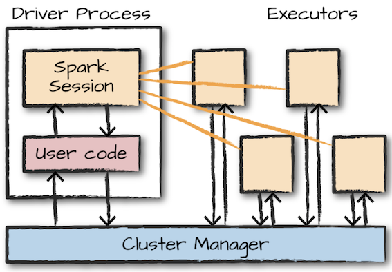

# 운영용 애플리케이션

# 클러스터에서 스파크 실행하기

스파크에서 코드를 실행할 때 어떤 일이 발생하는지?

결국 모든 스파크 코드는 동일한 방식으로 실행된다.

## 1. 스파크 애플리케이션의 아키텍쳐

  

- 스파크 드라이버
    스파크 애플리케이션의 `운전자 역할` 을 하는 프로세스.  
    드라이버는 스파크 애플리케이션의 실행을 제어하고 스파크 클러스터(익스큐터의 상태와 태스크)의 모든 상태 정보를 유지한다.  
    물리적 컴퓨팅 자원 확보와 익스큐터 실행을 위해 클러스터 매니저와 통신할 수 있어야 한다.  
    물리적 머신의 프로세스이며, 클러스터에서 실행 중인 애플리케이션의 상태를 유지함  

- 스파크 익스큐터
    스파크 드라이버가 할당한 태스크를 수행하는 프로세스  
    익스큐터는 드라이버가 할당한 태스크를 받아 실행하고 태스크의 상태와 결과(성공 or 실패)를 드라이버에 보고한다.  
    모든 스파크 애플리케이션은 개별 익스큐터 프로세스를 사용함  

- 클러스터 매니저
    스파크 드라이버와 익스큐터를 허공에 띄울 수는 없으므로, 클러스터 매니저가 필요하다.  
    클러스터 매니저는 스파크 애플리케이션을 실행할 클러스터 머신을 유지  
    ` 클러스터매니저 == 마스터 ` 라고 부르기도 함  

    이는 `드라이버` 와 `워커` 라는 개념을 가지고 있으며 이 때문에 혼란스러울 수도 있음  
    
    >__Note__
    > 이 개념 때문에 글쓴이는 현업에서 뭔소린지 잘 이해못한 경우가 많음

    프로세스가 아닌 물리적인 머신에 연결되는 개념이다.

      

    그림 왼쪽에 있는 머신은 클러스터 매니저의 드라이버 노드이며 원은 개별 워커노드를 실행하고 관리하는 데몬 프로세스.

    그림에서 스파크 애플리케이션은 아직 실행되지 않음. 표시된 원들은 클러스터 매니저의 프로세스일 뿐이다.

스파크 애플리케이션을 실제로 실행할 때가 되면 클러스터 매니저에 자원 할당을 요청  
스파크 애플리케이션의 실행 과정에서 클러스터 매니저는 애플리케이션이 실행되는 머신을 관리함.  
`사용자 애플리케이션의 설정에 따라 스파크 드라이버를 실행할 자원을 포함해 요청하거나 스파크 애플리케이션 실행을 위한 익스큐터 자원을 요청할 수도 있다.`

### 1.1 실행 모드
실행 모드는 애플리케이션을 실행할 때 요청한 자원의 물리적인 위치를 결정한다.

- 클러스터 모드
- 클라이언트 모드
- 로컬 모드

#### 클러스터 모드
가장 흔하게 사용되는 스파크 애플리케이션 실행방식  
이를 사용하려면 컴파일된 JAR 파일이나 파이썬 스크립트 또는 R 스크립트를 클러스터 매니저에 전달해야 함.  

  

하나의 워커노드에 스파크 드라이버를 할당하고 다른 워커 노드에 익스큐터를 할당하는 모습을 나타낸다.  

> __Note__
> 그림을 보면 헷갈리는게 드라이버 노드 드라이버 할당 익스큐터 할당 같은 용어들이 섞여나오는데,
> 왼쪽의 사각형 1개는 `클러스터`의 드라이버노드 이고 오른쪽 사각형 3개는 `클러스터`의 워커 노드
> 오른쪽 사각형(`클러스터`의 워커노드) 안에 들어있는 실선 사각형은 `스파크 드라이버`를 할당 받은 것이다. 이를 명확히 해놓을 필요가 있다.
> 실선 직사각형 : 드라이버 프로세스
> 점선 직사각형 : 익스큐터 프로세스

클러스터 매니저는 파일을 받고 워커노드에 드라이버와 익스큐터 프로세스를 실행  

즉, 클러스터 매니저는 모든 스파크 애플리케이션과 관련된 프로세스를 유지하는 역할

#### 클라이언트 모드

  

애플리케이션을 제출한 클라이언트 머신에 스파크 드라이버가 위치한다.

클라이언트 머신 : 스파크 드라이버 프로세스를 유지  
클러스터 매니저 : 익스큐터 프로세스를 유지

스파크 애플리케이션이 클러스터와 무관하나 머신에서 동작하는 것을 알 수 있음. 보통 이런 머신을 `게이트웨이 머신` 또는 `에지 노드` 라고 부름

드라이버는 클러스터 외부의 머신에서 실행되며, 나머지 워커는 클러스터에 위치한다.

#### 로컬 모드
모든 스파크 애플리케이션은 단일 머신에서 실행된다. 로컬 모드는, 애플리케이션의 병렬 처리를 위해 단일 머신의 `스레드` 를 활용한다. 이 모드는 스파크를 학습하거나 애플리케이션 테스트 그리고 개발 중인 애플리케이션을 반복적으로 실험하는 용도로 주로 사용.

> __NOTE__
> SK에서 서비스하는 대표적인 빅데이터 플랫폼인 Accuinsight를 사용하면 쉽게 운영용 애플리케이션을 실험하는 용도로 사용 가능하다.
> MCM 에서 클러스터를 쉽게 구성가능하기 때문

## 2. 스파크 애플리케이션의 생애주기(스파크 외부)

## 3. 스파크 애플리케이션의 생애주기(스파크 내부)

## 4. 세부 실행과정