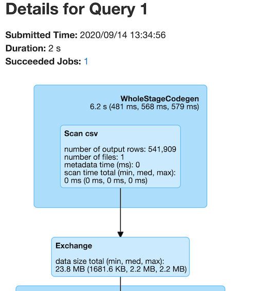

# 모니터링과 디버깅

## 1. 모니터링 범위
스파크 잡의 어느 지점에서 오류가 발생했는지 파악하려면 `스파크 잡`을 모니터링 해야 함

실제 모니터링 대상과 모니터링에 필요한 옵션을 알아야하며, 실제로 많이 쓰이고 잘 알아야 할 듯.

- 모니터링 대상 컴포넌트
    - 스파크 애플리케이션과 잡  
    클러스터에서 사용자 애플리케이션이 실행되는 상황을 파악하거나 디버깅하려면 가장 먼저 스파크UI와 스파크 로그를 확인해야 한다.

    실행중인 애플리케이션의 RDD와 쿼리 실행 계획같은 개념적 수준의 정보를 제공함.

    - JVM  
    스파크는 모든 익스큐터를 개별 JVM에서 실행. 따라서 코드가 실행되는 과정을 이해하기 위해 각 가상머신을 모니터링 해야 함.

    JVM 도구는 여러가지가 있고 내부 동작방식을 이해하는데 도움이 됨. 일부 정보는 스파크UI 에서도 확인가능  

    - OS와 머신  
    JVM은 호스트 OS에서 실행된다. 따라서 머신의 상태를 모니터링해 정상 작동 중인지 확인하는 것은 매우 중요

    CPU, 네트워크, I/O 등의 자원에 대한 모니터링도 함께 해야 함. 이러한 모니터링 요소들은 클러스터 수준 모니터링 솔루션에서 확인가능. `dstat, iostat, iotop` 같은 명령을 사용하면 더 세밀하게 모니터링 가능하다.  

    - 클러스터  
    스파크 애플리케이션이 실행되는 클러스터도 모니터링 해야함.

    여기서는 Yarn, mesos, standalone 클러스터매니저가 모니터링 대상이며, 모니터링 솔루션을 활용하면 클러스터가 동작하지 않는 상황을 빠르게 알 수 있음. 인기 있는 클러스터 모니터링 도구로는 `강글리아, 프로메테우스`가 있다.

## 2. 모니터링 대상
크게 두가지이며  
실행중인 사용자 애플리케이션의 프로세스(CPU, 메모리 사용률 등)  
프로세스 내부에서의 쿼리 실행 과정(잡과 태스크)이다.

- 드라이버와 익스큐터 프로세스
스파크 애플리케이션 모니터링 -> 스파크 드라이버 관찰  
드라이버에는 모든 애플리케이션의 상태가 보관되어, 안정적으로 실행 중인지 확인 가능.

먄약, 한 대의 머신이나 단일 JVM을 모니터링 해야 한다면, 당연히 드라이버를 모니터링 해야함. 익스큐터의 상태를 파악하는 것 또한 매우 중요하며, 이를 위해 메트릭 시스템을 갖추고 있음.

메트릭 시스템은 $SPARK_HOME/conf/metrics.properties 파일을 생성해 구성 가능

- 쿼리, 잡, 스테이지, 태스크
특정 쿼리에서 무슨 일이 일어나고 있는지 알아야 할 때도 있다.  
스파크는 `쿼리, 잡, 스테이지, 태스크` 의 개념을 가지고 있으며, 각각의 정보를 확인할 수 있다.(15장참고) 이러한 정보는 클러스터에서 특정 시점에 실행되는 작업을 파악 할 수있으며, `성능개선` 이나 `디버깅`시 매우 유용

## 3. 스파크 로그
스파크를 가장 상세하게 모니터링하는 방법 중 하나. 애플리케이션의 로그나 스파크 자체의 로그에서 발견된 이상한 이벤트는 잡의 실패 지점이나 원인을 파악하는데 큰 도움이 됨.  

파이썬은 스파크의 자바 기반 로깅 라이브러리를 사용할 수 없으므로 파이썬의 logging 모듈 또는 print 구문을 사용해 표준 요류로 결과를 출력해야 한다.

~~~spark
# 스파크의 로그 수준을 변경하는 코드
spark.sparkContext.setLogLevel("INFO")
~~~

로컬모드 : 로그 자체가 표준 오류로 출력  
클러스터 : 클러스터 매니저로 파일에 로그를 저장할 수 있음  

>__NOTE__  
> 기록된 로그로 모든 답을 구할 순 없다. 하지만, 로그를 검색하면 사용자가 직면한 문제를 정확히 파악가능  
> 미래를 위해 로그를 지속해서 수집하는 것이 좋음, 애플리케이션이 비정상적으로 종료되었다면 이유를 파악하기 위해 디버깅 해야하는데, 이미 종료된 상태라 디버깅이 불가능하다. 따라서 수집된 로그를 이용해 원인을 찾아야함.

## 4. 스파크 UI
1) 실행중인 애플리케이션  
2) 스파크 워크로드  
에 대한 평가지표를 모니터링 할 수 있는 화면을 제공함

- 모든 SparkContext 실행 시 4040포트로 기본 실행
- 다수의 애플리케이션을 실행 시 순차적으로 포트번호가 증가(4041,4042...)

  

스파크애플리케이션을 실행 후 <a href = "localhost:4040">localhost:4040</a> 로 접속하면 위 화면이 뜬다.

- Jobs: 스파크 잡에 대한 정보제공
- Stages: 개별 스테이지(스테이지의 태스크 포함)와 관련된 정보 제공
- Storage: 스파크 애플리케이션에 캐싱된 정보와 데이터 정보를 제공
- Enviroment: 스파크 애플리케이션의 구성과 설정 관련 정보를 제공
- Executors: 애플리케이션에서 사용 중인 익스큐터의 상세 정보 제공
- SQL: SQL과 DataFrame을 포함한 구조적 API 쿼리 정보 제공

~~~pyspark
spark.read\
.option("header", "true")\
.csv("./data/retail-data/all/online-retail-dataset.csv")\
.repartition(2)\
.selectExpr("instr(Description,'GLASS') >= 1 as is_glass")\
.groupBy("is_glass")\
.count()\
.collect()
~~~

위 코드의 결과는 여러 값을 가진 3개의 로우를 결과로 반환함. SQL 쿼리를 실행 했으므로 <a href = "localhost:4040">localhost:4040</a>에서 SQL 탭을 확인해보면

  

이와 같은 화면을 볼 수 있다.

가장 먼저 매우 중요한 쿼리에 대한 요약 통계가 나와 있음

~~~
Submitted Time: 2020/09/14 13:34:56
Duration: 2 s
Succeeded Jobs: 1
~~~

  

스파크 스테이지의 DAG를 먼저 살펴 보면, SQL 탭의 파란 상자는 스파크 태스크의 스테이지를 나타냄

이러한 스테이지의 전체 그룹은 스파크 잡을 나타낸다.

1) `WholeStageCodegen` 으로 표시된 상단의 상자는 CSV파일을 모두 스캔하는 스테이지를 나타낸다.
1-1) 하단의 상자는 파티션 재분배로 인해 발생하는 셔플 스테이지, 여기서 원본 데이터셋이 두개의 파티션으로 분할  

  

2) 프로젝션(컬럼 선택/추가/필터링)과 집계를 수행. 6개의 로우가 반환된 것을 알 수 있음. 스파크는 최종 단계를 위한 준비작업으로 데이터를 셔플하기 전에 `파티션별로 집계`를 수행.  
해시 기반의 집계이므로, 파티션별 집계 결과 수와 파티션 수를 곱해 결과로 반환되는 로우 수를 계산가능.

  

3) 마지막 스테이지는 이전 스테이지의 결과에 대한 집계를 수행. 이전 스테이지의 두 개 결과 파티션을 결합해, 쿼리의 결과로 세 개 로우를 반환한다.

  

스파크 잡의 실행 과정을 알아보기 위해 Jobs 탭에서 1번 잡(두번 째)을 클릭하면, 잡은 세 개의 스테이지로 나뉘어 있음(SQL 탭에서 본 것과 일치)

Description의 링크 중 하나를 클릭하면 스테이지에 대한 자세한 내용을 확인 할 수 있다.

이 잡은 세개의 스테이지로 구성, 각각 11,2,200개의 태스크를 실행. 각 스테이지를 살펴보면,

Stage 1) 11개의 태스크를 가진다. CSV파일은 분할 가능하기 때문에 스파크는 작업을 나눌 수 있음. 스파크는 작업을 머신의 여러 코어에 비교적 고르게 배분한다. 이 동작은 클러스터 영역에서 발생하며, 사용자가 데이터를 저장하는 방식인 파일 저장 방법과 관련된 중요한 최적화 요소.

Stage 2) 데이터를 두 개의 파티션으로 나누기 위해 repartition 명령을 사용했으므로 두개의 태스크를 가짐.

Stage 3) 셔플 파티션의 기본값은 200이므로 마지막 스테이지는 200개의 태스크를 가짐.  

  

11개의 태스크를 가진 첫 번째 스테이지를 클릭해 더 상세한 정보를 확인 할 수 있다.

스파크는 잡이 실행 됐을 때, 어떤 동작을 했는지 수많은 정보를 제공함. 

1) `Summary Metrics` : 부분에서는 다양한 메트릭에 관한 요약통계 제공, 균일하지 않게 분산된 값을 눈여겨 봐야 한다.

2) `Aggregated Metrics by Executor` : 하단의 표로 익스큐터별 통계를 확인가능, 예제의 경우 하나의 익스큐터가 모든 코어를 사용한다. 특정 익스큐터가 워크로드를 처리하는 데 어려움을 겪는지 판단할 때 유용

### 기타 스파크 UI 탭
나머지 스파크 UI 탭은 명확한 의미의 이름을 가진 'Storage', 'Environment', 'Executors'임.

1) Storage : 클러스터에 캐시된 RDD나 DataFrame과 관련된 정보 제공, 시간이 지나 캐시된 데이터가 사라졌는지 확인 가능  
2) Environment : 클러스터에 설정된 다양한 스파크 속성뿐 아니라, 스칼라나 자바와 관련된 정보등 런타임 환경 관련 정보 제공

### 스파크 UI 히스토리 서버
스파크 UI는 SparkContext가 실행되는 동안 사용가능. 정상적으로 종료되거나 비정상적으로 종료된 애플리케이션의 정보를 확인하려면, 스파크 히스토리서버를 이용해야 한다.

`이벤트 로그` 를 저장하도록 스파크 애플리케이션을 설정하면 스파크 히스토리 서버를 이용해 스파크 UI와 REST API를 재구성할 수 있다.

## 5. 디버깅 및 스파크 응급 처치

<추후에 정리>